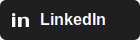

# Hey, I’m Amartya Singh

**Solo founder & Full Stack Engineer** 
Passionate about **TypeScript**, **Next.js**, **Node.js**, **AI**, and **Web3**.  
Based in India, building everyday.

---

## Working at
- **[Avail](https://availproject.co)** as a frontend engineer.
- Built **[Nexus SDK](https://www.npmjs.com/package/@avail-project/nexus-core)** to bring cross-chain liquidity to users and dApps.
- Prebuilt React components distributed via shadcn/ui cli **[Nexus Elements](https://elements.nexus.availproject.org/)** to bring cross-chain liquidity to users and dApps.

---

## Featured Projects

| Project | Description | Tech |
|---------|-------------|------|
| [**Cliply**](https://cliply.fun) | One-click repurposing of long videos into viral short clips. AI highlights, subtitles, and smart reframing. | TypeScript, Next.js, Node.js, GCP, FFmpeg |
| [**Git Receipts**](https://gitreceipts.vercel.app/) | Generate clean receipts from git commit history. | TypeScript, Next.js, GraphQL |
| [**Resume Builder**](https://easy-resumes.vercel.app/) | Build beautiful resumes from structured JSON data. | TypeScript, Next.js |
| [**Portfolio v2.0**](https://www.decocereus.dev/) | My portfolio site built with Next.js and TypeScript. | TypeScript, Next.js |

---

## Tech Stack
**Languages:** TypeScript · JavaScript · HTML · CSS  
**Frameworks:** Next.js · React · Express.js  
**Cloud & Infra:** GCP · Docker · Firebase  
**Tools:** FFmpeg · Git · TailwindCSS

---

## GitHub Overview

  
  

## Find me at 

  
  
  

---

> **"Code is never just code, it’s leverage."**
